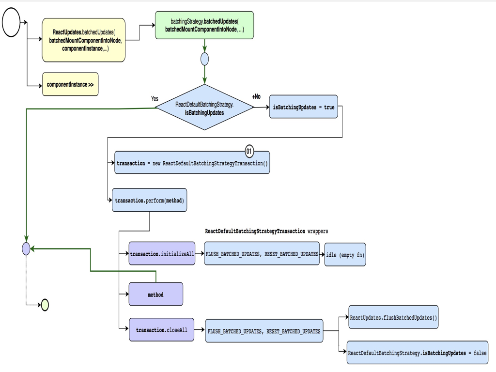

# ⛱3.BatchUpdate和setState
### 3-1.BatchUpdate
> 之前我们已经多次的探讨过这个批处理了batchedUpdates，那么他到底做了什么是如何工作的呢？
```JavaScript
import React from 'react';
import { unstable_batchedUpdates as batchedUpdates } from "react-dom";
const { Component } = React;
class App extends Component {
  constructor(props) {
    super(props);
    this.state = {
      count: 0
    };
  }
  test(){
    this.setState({
      count: this.state.count + 1
    });
    this.setState({
      count: this.state.count + 1
    });
  }
  componentDidMount() {
    let me = this;
    me.setState({
      count: me.state.count + 1
    });
    console.log(me.state.count);    // 打印
    me.setState({
      count: me.state.count + 1
    });
    console.log(me.state.count);    // 打印
    setTimeout(function () {
      me.setState({
        count: me.state.count + 1
      });
      console.log('第一次', me.state.count);   // 打印
    }, 0);
    console.log("batchedUpdates", batchedUpdates)
    setTimeout(function () {
      batchedUpdates(() => {
        me.setState({
          count: me.state.count + 1
        })
      })
    }, 0);
    console.log('第二次', me.state.count);   // 打印
  }
  render() {
    return (
      <div>
        <h1>{this.state.count}</h1>
        <button onClick={this.test.bind(this)}>增加count</button>
      </div>
    );
  }
}

export default App;
```




> 首先我们可以在requestWork打debugger,因为整个react的更新调度都会进入到这个函数。接着，批量更新分为两种情况，一种是渲染中的时候并不会进入到BatchingUpdates。enqueueSetState我们可以看到当前的状态存储情况。最终调用performWork通过寻找findHighestPriorityRoot最高优先级任务 执行任务的调度.

### 3-2.setState到底怎么答？
> 先等到组件已经渲染完成，setState是同步执行的，但是不会立马更新，因为他在批量处理中会等待组件render才真正触发,不在批处理中的任务可能会立马更新。到底更新不更新要取决于setState是否在Async的渲染过程中，因为他会进入到异步调度过程。如果setState处于我们某个生命周期中，暂时不会BatchUpdate参与，因为组件要尽早的提前渲染。

---

志佳老师@2019
