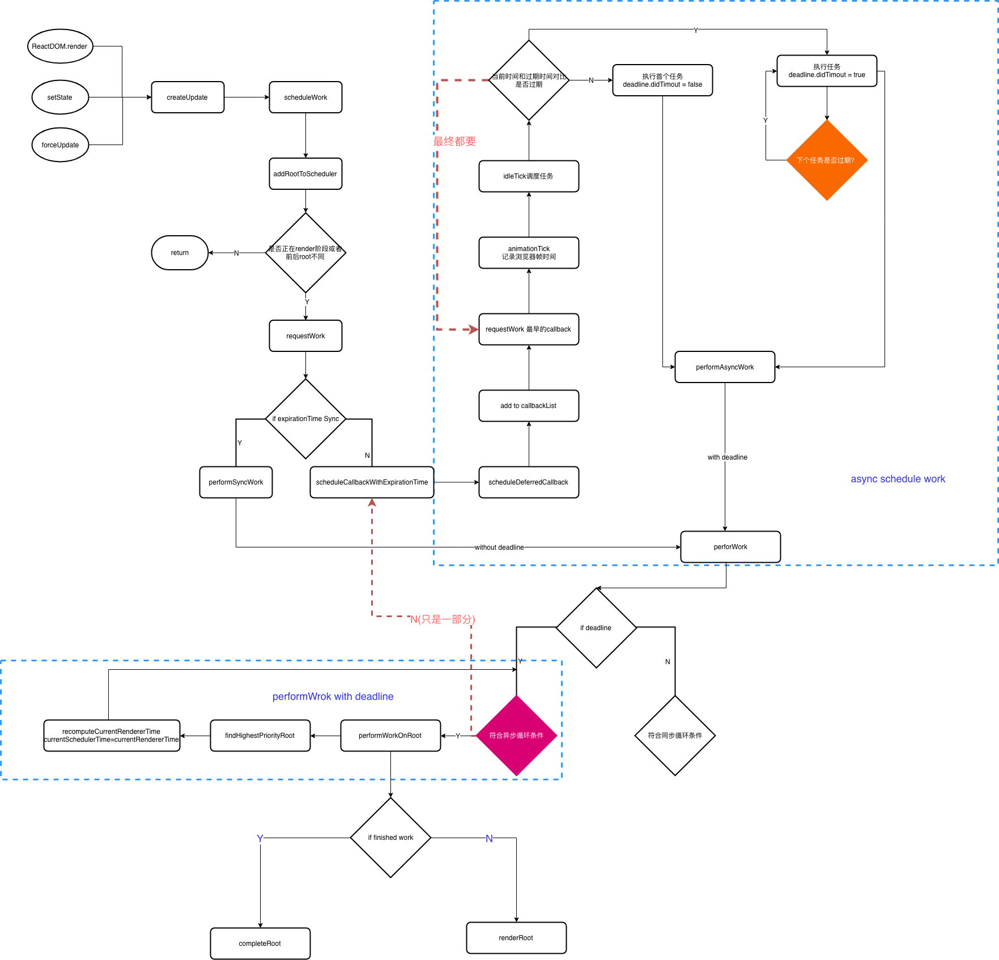

# 🛰4.Fiber 调度更新流程

### 4-1.scheduleCallback

> JavaScript 在浏览器的主线程上运行，通常样式计算、布局以及页面绘制会一起运行。如果 JavaScript 运行时间过长，就会阻塞这些其他工作，可能导致掉帧，在首次渲染过程中构建出 Virtual DOM Tree，后续需要更新时（setState()），diff Virtual DOM Tree 得到 DOM change，并把 DOM change 应用（patch）到 DOM 树。自顶向下的递归 mount/update，无法中断（持续占用主线程），这样主线程上的布局、动画等周期性任务以及交互响应就无法立即得到处理，影响体验。所以才有了 Fiber。
>
> 把渲染/更新过程（递归 diff）拆分成一系列小任务，每次检查树上的一小部分，做完看是否还有时间继续下一个任务，有的话继续，没有的话把自己挂起，主线程不忙的时候再继续。
>
> 在 requestWork 最后会判断是原始的 React 的更新模式还是异步的方式去更新，我们来重点关注一下 scheduleCallbackWithExpirationTime。 调度 scheduler.unstable_scheduleCallback 开始执行我们的异步任务

```JavaScript
  if (callbackExpirationTime !== NoWork) {
    // 如果之前已经在执行一个callback
    if (expirationTime < callbackExpirationTime) {
      // 比较之前的过期时间和当前的过期时间
      return;
    } else {
      if (callbackID !== null) {
        //如果晚于当前时间及时cancel
        scheduler.unstable_cancelCallback(callbackID);
      }
    }
  } else {
    startRequestCallbackTimer();
  }
```



> 首先我们可以在 requestWork 打 debugger,因为整个 react 的更新调度都会进入到这个函数。接着，批量更新分为两种情况，一种是渲染中的时候并不会进入到 BatchingUpdates。enqueueSetState 我们可以看到当前的状态存储情况。最终调用 performWork 通过寻找 findHighestPriorityRoot 最高优先级任务 执行任务的调度.

### 4-2.总结之前e

> 增量更新需要更多的上下文信息，之前的 Virtual DOM Tree 显然难以满足，所以扩展出了 fiber tree（即 Fiber 上下文的 Virtual DOM Tree），更新过程就是根据输入数据以及现有的 fiber tree 构造出新的 fiber tree（workInProgress tree）。因此，Instance 层新增了这些实例：

* 【DOM】真实 DOM 节点

* 【effect】 每个 workInProgress tree 节点上都有一个 effect list
用来存放 diff 结果
当前节点更新完毕会向上 merge effect list（queue 收集 diff 结果）

* workInProgress tree 是 reconcile 过程中从 fiber tree 建立的当前进度快照，用于断点恢复

* fiber tree 与 Virtual DOM Tree 类似，用来描述增量更新所需的上下文信息

* Elements描述 UI 长什么样子（type, props）

```JavaScript
// fiber tree 实际上是个单链表（Singly Linked List）树结构如下：
{
  // 状态节点
  stateNode, 
  // 子节点
  child, 
   // 表示当前节点处理完毕后，应该向谁提交自己的成果（effect list）
  return,
  // 兄弟节点
  sibling, 
  ...
}
```
> 1.react -> reactDom -> reactRender -> firberroot(children) ->
 updataeContainier->过期时间->scheduleWork
2.react -> reactDom -> react-reconciler -> ReactFiberWorkLoop -> 
requestWork(类似于原始的react调度方式)-》performsysnc ->  scheduler.unstable_scheduleCallback
scheduler（具体的算法库）

### 4-3.Dom diff

> React 的 Dom diff 和 Vue 的发展到今天还是有非常本质的差别的，，React 分别对 tree diff、component diff 以及 element diff 进行算法优化。大家可以打开ReactFiberCompleteWork对于不是第一次创建的组件将会进入到updateHostComponent就是详细的过程

---

志佳老师@2019
